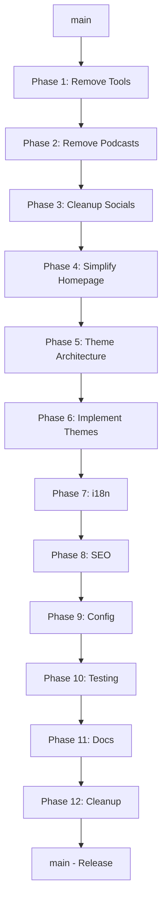

# Git Branching Strategy for Blog Platform Refactoring

## Overview

This document outlines the branching strategy for the systematic refactoring of the dating advice application into a clean, reusable blog platform. The strategy ensures code stability, enables parallel development when possible, and maintains a clear audit trail of changes.

## Branch Naming Convention

### Format

```
<type>/<phase>-<description>
```

### Types

- `refactor/` - Refactoring existing code
- `feature/` - Adding new functionality
- `fix/` - Bug fixes during refactoring
- `docs/` - Documentation updates
- `test/` - Test-related changes

### Examples

```
refactor/phase-1-remove-tools
refactor/phase-2-remove-podcasts
feature/theme-switcher-ui
fix/broken-tests-phase-3
docs/theme-documentation
```

---

## Branch Hierarchy

```
main (production)
│
├── refactor/phase-1-remove-tools
│   └── fix/tools-cleanup-tests
│
├── refactor/phase-2-remove-podcasts (from phase-1)
│   └── fix/podcast-removal-navigation
│
├── refactor/phase-3-cleanup-socials (from phase-2)
│
├── refactor/phase-4-simplify-homepage (from phase-3)
│
├── refactor/phase-5-theme-architecture (from phase-4)
│   ├── feature/theme-provider-integration
│   └── feature/theme-toggle-component
│
├── refactor/phase-6-implement-themes (from phase-5)
│   ├── feature/dark-theme
│   ├── feature/minimal-theme
│   └── feature/bold-theme
│
├── refactor/phase-7-internationalization (from phase-6)
│   ├── feature/locale-routing
│   ├── feature/translation-system
│   └── feature/language-switcher
│
├── refactor/phase-8-seo-optimization (from phase-7)
│   ├── feature/structured-data
│   └── feature/sitemap-generation
│
├── refactor/phase-9-blog-config (from phase-8)
│
├── refactor/phase-10-testing-suite (from phase-9)
│   ├── test/a11y-tests
│   └── test/lighthouse-ci
│
├── refactor/phase-11-documentation (from phase-10)
│
└── refactor/phase-12-final-cleanup (from phase-11)
```

---

## Workflow Rules

### 1. Sequential Phase Branches

- Each phase branch MUST be created from the previous phase branch (not from main)
- This ensures changes build upon each other correctly
- Example: `refactor/phase-2-remove-podcasts` branches from `refactor/phase-1-remove-tools`

### 2. Sub-branches for Complex Changes

- For complex phases, create feature branches from the phase branch
- Merge back to the phase branch before proceeding
- Example: `feature/theme-toggle-component` branches from `refactor/phase-5-theme-architecture`

### 3. Testing Requirements

- All tests MUST pass before merging to the next phase
- Run full test suite: `pnpm validate`
- Run E2E tests: `pnpm e2e`
- Document any temporarily skipped tests with TODO comments

### 4. Merge Strategy

- Use **squash and merge** for sub-branches → phase branches
- Use **merge commit** for phase branches → main
- This maintains a clean history while preserving phase boundaries

---

## Phase-by-Phase Workflow

### Starting a New Phase

```bash
# 1. Ensure previous phase is complete
git checkout refactor/phase-1-remove-tools
pnpm validate
pnpm e2e

# 2. Create new phase branch
git checkout -b refactor/phase-2-remove-podcasts

# 3. Make changes
# ... implement changes ...

# 4. Commit with descriptive message
git add -A
git commit -m "refactor(phase-2): remove podcast system

- Remove app/podcasts directory
- Remove podcast components
- Update feature toggles
- Clean up navigation"

# 5. Push branch
git push -u origin refactor/phase-2-remove-podcasts
```

### Creating a Sub-branch

```bash
# 1. Start from phase branch
git checkout refactor/phase-5-theme-architecture

# 2. Create feature branch
git checkout -b feature/theme-toggle-component

# 3. Implement feature
# ... make changes ...

# 4. Commit
git add -A
git commit -m "feat: add theme toggle component with dark/light modes"

# 5. Push and create PR to phase branch
git push -u origin feature/theme-toggle-component
```

### Merging Back to Main

```bash
# 1. Ensure all phase tests pass
git checkout refactor/phase-12-final-cleanup
pnpm validate
pnpm e2e
pnpm lh:local

# 2. Create PR to main
# Use GitHub/GitLab UI to create PR

# 3. After approval, merge with merge commit
# This preserves the refactoring history
```

---

## Commit Message Convention

### Format

```
<type>(<scope>): <subject>

<body>

<footer>
```

### Types

- `refactor`: Code refactoring
- `feat`: New feature
- `fix`: Bug fix
- `docs`: Documentation
- `test`: Test updates
- `chore`: Maintenance tasks
- `perf`: Performance improvements

### Examples

```
refactor(phase-1): remove AI tools and dependencies

- Delete app/tools directory
- Remove @ai-sdk/openai and ai packages
- Update feature toggles
- Clean up navigation components
- Update sitemap generation

BREAKING CHANGE: AI tools functionality removed
```

```
feat(theme): add multi-theme support with CSS variables

- Implement three-tier token system
- Add theme provider integration
- Create theme toggle component
- Support light, dark, minimal, and bold themes
```

---

## Pull Request Template

```markdown
## Phase: [Phase Number] - [Phase Name]

### Description

Brief description of what this phase accomplishes

### Changes Made

- [ ] List of specific changes
- [ ] Another change
- [ ] More changes...

### Testing

- [ ] All unit tests pass (`pnpm test`)
- [ ] All E2E tests pass (`pnpm e2e`)
- [ ] Lint checks pass (`pnpm lint`)
- [ ] Type checks pass (`pnpm type-check`)
- [ ] Build succeeds (`pnpm build`)

### Breaking Changes

List any breaking changes or N/A

### Screenshots

If applicable, add screenshots

### Checklist

- [ ] Code follows project style guidelines
- [ ] Self-review completed
- [ ] Comments added for complex code
- [ ] Documentation updated
- [ ] No new warnings introduced
```

---

## Conflict Resolution

### When Conflicts Occur

1. **Between phase branches**: Resolve in favor of the later phase
2. **With main**: The phase branch takes precedence
3. **Between sub-branches**: Discuss with team before resolution

### Resolution Process

```bash
# 1. Update your branch with latest changes
git checkout refactor/phase-3-cleanup-socials
git pull origin refactor/phase-2-remove-podcasts

# 2. Resolve conflicts
# Edit conflicted files
git add <resolved-files>
git commit -m "fix: resolve conflicts from phase-2"

# 3. Verify tests still pass
pnpm validate
```

---

## Rollback Strategy

### Phase Rollback

If a phase introduces critical issues:

```bash
# 1. Identify the last stable phase
git log --oneline

# 2. Create a rollback branch
git checkout refactor/phase-2-remove-podcasts
git checkout -b fix/rollback-phase-3

# 3. Cherry-pick any critical fixes
git cherry-pick <commit-hash>

# 4. Merge to main as hotfix
```

### Emergency Rollback

For production issues:

```bash
# 1. Revert to last stable tag
git checkout main
git revert <merge-commit-hash>
git push origin main

# 2. Create hotfix branch
git checkout -b hotfix/critical-issue
```

---

## Best Practices

### 1. Keep Phases Small

- Each phase should be completable in 1-2 days
- Break large phases into sub-phases if needed

### 2. Document Everything

- Update REFACTORING.md progress after each phase
- Add inline comments for complex changes
- Update README if user-facing changes occur

### 3. Test Continuously

- Run tests before committing
- Set up pre-commit hooks if possible
- Use CI/CD for automated testing

### 4. Communicate Changes

- Use descriptive branch names
- Write clear commit messages
- Update team on phase completion

### 5. Maintain Backwards Compatibility

- Keep URLs functional (add redirects if needed)
- Preserve API contracts
- Document breaking changes clearly

---

## Git Commands Reference

### Common Commands

```bash
# Create new phase branch
git checkout -b refactor/phase-X-description

# Push new branch
git push -u origin refactor/phase-X-description

# Update branch with previous phase
git pull origin refactor/phase-{X-1}-description

# Check branch status
git status

# View branch history
git log --oneline --graph

# List all branches
git branch -a

# Delete local branch
git branch -d branch-name

# Delete remote branch
git push origin --delete branch-name
```

### Useful Aliases

Add to your `.gitconfig`:

```ini
[alias]
    # Show branch tree
    tree = log --graph --pretty=format:'%Cred%h%Creset -%C(yellow)%d%Creset %s %Cgreen(%cr) %C(bold blue)<%an>%Creset' --abbrev-commit

    # Show current phase
    phase = branch --show-current

    # Quick status
    st = status -sb

    # Amend last commit
    amend = commit --amend --no-edit
```

---

## CI/CD Integration

### GitHub Actions Workflow

```yaml
name: Phase Validation

on:
  push:
    branches:
      - 'refactor/phase-*'
      - 'feature/*'
      - 'fix/*'
  pull_request:
    branches:
      - main
      - 'refactor/phase-*'

jobs:
  validate:
    runs-on: ubuntu-latest
    steps:
      - uses: actions/checkout@v3
      - uses: pnpm/action-setup@v2
      - uses: actions/setup-node@v3
        with:
          node-version: '20'
          cache: 'pnpm'

      - name: Install dependencies
        run: pnpm install --frozen-lockfile

      - name: Run validation
        run: pnpm validate

      - name: Run E2E tests
        run: pnpm e2e

      - name: Build project
        run: pnpm build
```

---

## Timeline and Milestones

### Week 1: Foundation Cleanup

- ✅ Phase 1: Remove tools
- ✅ Phase 2: Remove podcasts
- ✅ Phase 3: Cleanup socials
- ✅ Phase 4: Simplify homepage

### Week 2: Theme System

- ⏳ Phase 5: Theme architecture
- ⏳ Phase 6: Implement themes

### Week 3: Internationalization

- ⏳ Phase 7: i18n implementation

### Week 4: Optimization

- ⏳ Phase 8: SEO optimization
- ⏳ Phase 9: Blog configuration
- ⏳ Phase 10: Testing suite

### Week 5: Polish

- ⏳ Phase 11: Documentation
- ⏳ Phase 12: Final cleanup

---

## Emergency Contacts

In case of critical issues during refactoring:

1. **Check Documentation**
   - This document
   - REFACTORING.md
   - Original Next.js docs

2. **Review Tests**
   - Check failing test messages
   - Review test files for context
   - Run tests in watch mode: `pnpm test --watch`

3. **Rollback if Needed**
   - Follow rollback strategy above
   - Don't hesitate to revert problematic changes
   - Focus on keeping main stable

---

## Appendix: Phase Dependencies

Visual representation of phase dependencies:



---

## Conclusion

This branching strategy ensures:

- **Stability**: Main branch remains stable
- **Traceability**: Clear history of changes
- **Flexibility**: Ability to work on sub-features
- **Safety**: Easy rollback if issues arise
- **Quality**: Enforced testing at each phase

Follow this strategy to ensure a smooth, organized refactoring process that maintains code quality and project stability throughout the transformation.
