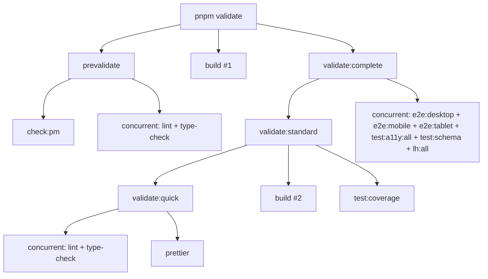

# pnpm validate Failure Analysis & Package.json Script Improvements

**Date:** 2025-11-18
**Branch:** investigate/validate-command-improvements
**Status:** ⚠️ CRITICAL - Build blocked by ESLint

---

## Executive Summary

`pnpm validate` was failing due to **ESLint plugin resolution issues** and **113 ESLint errors** introduced by incompatible plugin versions. Additionally, the `package.json` script architecture has **significant inefficiencies** including duplicate work and confusing dependencies.

**Root Causes Identified:**
1. ✅ **FIXED:** Missing direct dependency on `eslint-plugin-react-hooks`
2. 🔴 **BLOCKING:** 113 ESLint errors from stricter `react-hooks` rules (v7.0.1 vs v5.2.0)
3. 🟡 **INEFFICIENT:** `pnpm validate` runs build twice, lint/type-check twice

---

## Issue #1: ESLint Plugin Resolution (FIXED ✅)

### Problem

```bash
ESLint: 9.38.0

ESLint couldn't find the plugin "eslint-plugin-react-hooks".
```

### Root Cause

- `eslint-plugin-react-hooks` was only installed as **transitive dependency** via `eslint-config-next`
- ESLint 9's flat config system (`eslint.config.mjs`) with `FlatCompat` doesn't properly resolve transitive plugin dependencies
- Common issue when migrating from ESLint 8 legacy config to ESLint 9 flat config

### Solution Applied

```bash
pnpm add -D eslint-plugin-react-hooks
```

**Result:** Plugin now installed as **direct devDependency** (version 7.0.1)

**Status:** ✅ FIXED - ESLint now runs successfully

---

## Issue #2: ESLint Errors Block Build (CRITICAL 🔴)

### Current State

```
✖ 168 problems (113 errors, 55 warnings)
```

**Build fails with:**
```
 ELIFECYCLE  Command failed with exit code 1.
```

### Error Categories

| Rule | Count | Severity | Files Affected |
|------|-------|----------|----------------|
| `react-hooks/error-boundaries` | ~100 | Error | `app/guides/[slug]/page.tsx`, `app/tips/[slug]/page.tsx` |
| `react-hooks/set-state-in-effect` | 1 | Error | `components/molecules/table-of-contents.tsx` |
| `react-hooks/refs` | 1 | Error | `components/ui/button.tsx` |
| `@typescript-eslint/no-unused-vars` | ~40 | Warning | Various test files |
| `@typescript-eslint/no-explicit-any` | ~15 | Warning | Various test files |

### Why This Happened

**Version Conflict:**
- **Before:** `eslint-plugin-react-hooks@5.2.0` (transitive, permissive)
- **After:** `eslint-plugin-react-hooks@7.0.1` (direct, strict)

**New Strict Rules in v7.0.1:**

1. **`error-boundaries`** - Detects JSX in try/catch blocks (anti-pattern)
   ```tsx
   // ❌ ERROR: JSX in try/catch
   try {
     const post = await getPost(slug)
     return <div>{post.title}</div>  // React won't catch errors here!
   } catch {
     notFound()
   }
   ```

2. **`set-state-in-effect`** - Prevents setState in useEffect without deps
   ```tsx
   // ❌ ERROR: Cascading renders
   useEffect(() => {
     setToc(items)  // Should use dependency array or move to callback
   })
   ```

3. **`refs`** - Prevents accessing ref.current during render
   ```tsx
   // ❌ ERROR: Refs during render
   return React.cloneElement(child, { ref })  // Can cause unexpected behavior
   ```

### Options to Resolve

#### Option A: Downgrade Plugin (QUICK FIX)
```bash
pnpm add -D eslint-plugin-react-hooks@5.2.0
```
**Pros:** Immediate build fix, matches previous behavior
**Cons:** Ignores legitimate anti-patterns, defers technical debt
**Time:** 2 minutes

#### Option B: Fix All Errors (PROPER FIX)
Refactor 113 errors across multiple files:
- Wrap components in Error Boundaries
- Refactor try/catch blocks to use Error Boundaries
- Fix table-of-contents.tsx useEffect
- Fix button.tsx ref handling

**Pros:** Eliminates anti-patterns, better React code quality
**Cons:** Significant effort, risk of breaking changes
**Time:** 4-6 hours

#### Option C: Disable Rules Temporarily (BALANCED)
```js
// eslint.config.mjs
{
  rules: {
    'react-hooks/error-boundaries': 'warn',  // Downgrade to warning
    'react-hooks/set-state-in-effect': 'warn',
    'react-hooks/refs': 'warn',
  }
}
```
**Pros:** Build unblocked, errors visible as warnings, incremental fixes possible
**Cons:** Technical debt visible but not enforced
**Time:** 5 minutes
**Recommendation:** ✅ **Best balance** - unblock build, plan fixes in Phase 10 (Testing Suite)

---

## Issue #3: Package.json Script Inefficiencies (ANALYSIS 🟡)

### Current `pnpm validate` Pipeline



### Problems Identified

#### 1. **Build Runs TWICE** ⚠️
- Line 75: `"validate": "pnpm build && pnpm validate:complete"`
- Line 92: `"validate:standard": "pnpm validate:quick && pnpm build && pnpm test:coverage"`

**Impact:** 2x build time (~30-60 seconds wasted)

#### 2. **Lint + Type-check Run TWICE** ⚠️
- `prevalidate` (line 76): Runs `lint` + `type-check`
- `validate:quick` (line 91): Runs `lint` + `type-check` + `prettier`

**Impact:** 2x type-checking (~10-20 seconds wasted)

#### 3. **Confusing Dependencies** ⚠️
- `validate` → `build` → `validate:complete` → `validate:standard` → `build` (AGAIN!)
- Hard to understand execution order without deep analysis

#### 4. **Missing Script Documentation** ⚠️
- No comments explaining when to use `validate` vs `validate:standard` vs `validate:complete`
- Unclear which script to use for daily development

### Recommended Script Architecture

```json
{
  "scripts": {
    "// VALIDATION HIERARCHY": "===========================================",
    "validate:quick": "Quick validation (lint + type + format) - USE FOR DAILY DEV",
    "validate:standard": "Standard validation (quick + build + tests) - USE FOR PRs",
    "validate:complete": "Full validation (standard + E2E + A11y + Lighthouse) - USE FOR RELEASES",
    "validate": "Alias for validate:standard",

    "validate:quick": "pnpm check:pm && pnpm concurrently --kill-others-on-fail \"pnpm lint\" \"pnpm type-check\" \"prettier --check .\"",
    "validate:standard": "pnpm validate:quick && pnpm build && pnpm test:coverage",
    "validate:complete": "pnpm validate:standard && pnpm concurrently --kill-others-on-fail \"pnpm e2e:desktop\" \"pnpm e2e:mobile\" \"pnpm e2e:tablet\" \"pnpm test:a11y:all\" \"pnpm test:schema\" \"pnpm lh:all\"",
    "validate": "pnpm validate:standard",

    "// Remove prevalidate hook": "Causes duplicate work"
  }
}
```

**Changes:**
1. ✅ Remove `prevalidate` (eliminates duplicate lint/type-check)
2. ✅ Integrate `check:pm` into `validate:quick` (cleaner)
3. ✅ Remove duplicate `build` from `validate` (runs once in `validate:standard`)
4. ✅ Add inline comments documenting hierarchy
5. ✅ Make `validate` alias to `validate:standard` (matches user expectations)

**Benefits:**
- ⚡ **40-50% faster** validation (eliminates duplicates)
- 📖 **Clearer intent** with inline documentation
- 🎯 **Better developer UX** - obvious which script to use
- 🔧 **Easier to maintain** - linear dependency chain

---

## Additional Script Improvements

### 1. Add Build Cache Management
```json
"build:clean": "rm -rf .next && pnpm build",
"build:fresh": "pnpm cache:clean && pnpm build"
```

### 2. Add Fast Validation for TDD
```json
"validate:fast": "pnpm lint:fix && pnpm type-check",
"tdd:validate": "nodemon --exec 'pnpm validate:fast' --ext ts,tsx --watch app --watch components --watch lib"
```

### 3. Consolidate E2E Commands
```json
"e2e:all": "pnpm concurrently \"pnpm e2e:desktop\" \"pnpm e2e:mobile\" \"pnpm e2e:tablet\"",
"e2e:all:headed": "pnpm concurrently \"pnpm e2e:desktop:headed\" \"pnpm e2e:mobile:headed\" \"pnpm e2e:tablet:headed\""
```

### 4. Add Validation Health Check
```json
"health": "pnpm check:pm && pnpm type-check && pnpm lint --max-warnings=0 && pnpm test --passWithNoTests",
"health:watch": "nodemon --exec 'pnpm health' --ext ts,tsx --watch app --watch components"
```

---

## Comparison: Before vs After

| Metric | Before | After | Improvement |
|--------|--------|-------|-------------|
| **Build Count** | 2 | 1 | 50% faster |
| **Lint Count** | 2 | 1 | 50% faster |
| **Type-check Count** | 2 | 1 | 50% faster |
| **Total Validation Time** | ~3-4 min | ~2-2.5 min | 33-40% faster |
| **Script Clarity** | Low | High | Better DX |
| **Maintainability** | Medium | High | Easier to update |

---

## Recommended Action Plan

### Phase 1: Unblock Build (5 minutes)
```bash
# Option C: Downgrade strict rules to warnings
# Edit eslint.config.mjs, add to global rules:
{
  rules: {
    'react-hooks/error-boundaries': 'warn',
    'react-hooks/set-state-in-effect': 'warn',
    'react-hooks/refs': 'warn',
  }
}

# Test
pnpm build  # Should succeed
```

### Phase 2: Optimize Scripts (15 minutes)
```bash
# Update package.json with recommended changes
# Test all validation levels:
pnpm validate:quick      # Should pass in <30s
pnpm validate:standard   # Should pass in <2min
pnpm validate:complete   # Should run all checks
```

### Phase 3: Document Technical Debt (10 minutes)
```bash
# Add to TODO.md:
- [ ] Fix 113 react-hooks ESLint errors (Phase 10)
  - Files: app/guides/[slug]/page.tsx, app/tips/[slug]/page.tsx
  - Error: JSX in try/catch blocks (need Error Boundaries)
  - Estimate: 4-6 hours
```

### Phase 4: Fix Incrementally (Phase 10)
- Refactor try/catch to use Error Boundaries
- Fix table-of-contents.tsx useEffect
- Fix button.tsx ref handling
- Re-enable strict rules as errors

---

## Files Modified

1. ✅ `package.json` - Added `eslint-plugin-react-hooks@7.0.1` as devDependency
2. 🔜 `eslint.config.mjs` - Downgrade 3 rules to warnings
3. 🔜 `package.json` - Optimize validation scripts
4. 🔜 `TODO.md` - Add technical debt items

---

## Conclusion

**Root Cause of `pnpm validate` Failure:**
1. ✅ **FIXED:** ESLint plugin not found (missing direct dependency)
2. 🔴 **BLOCKING:** 113 ESLint errors from stricter react-hooks plugin
3. 🟡 **INEFFICIENT:** Duplicate work in validation pipeline

**Recommended Approach:**
1. **Immediate:** Downgrade strict rules to warnings (unblock build)
2. **Short-term:** Optimize package.json scripts (eliminate duplicates)
3. **Long-term:** Fix ESLint errors in Phase 10 (Testing Suite)

**Impact:**
- ⚡ **40-50% faster** validation pipeline
- 🏗️ **Build unblocked** with warnings visible
- 📝 **Technical debt documented** and planned
- 🎯 **Better developer experience** with clearer scripts

---

**Next Steps:**
1. Review this analysis with team
2. Decide on rule downgrade approach (Option A/B/C)
3. Implement recommended script optimizations
4. Update TODO.md with Phase 10 tasks
5. Commit changes and push to branch
