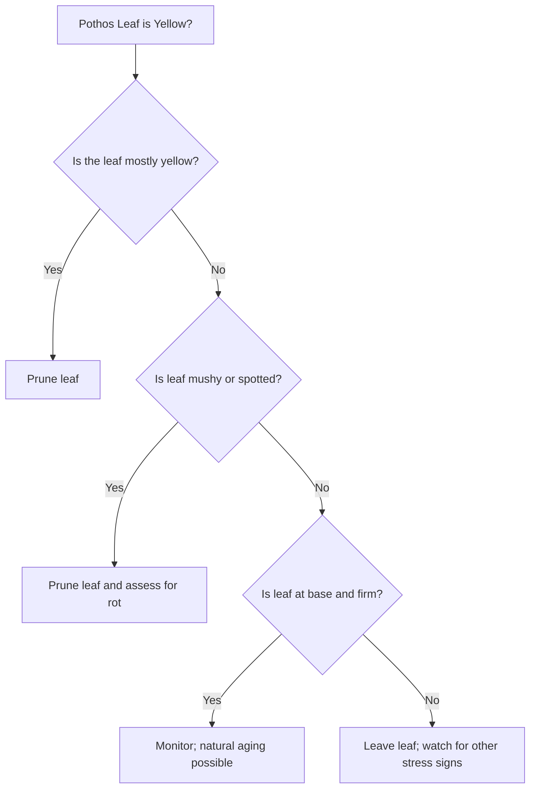

# Stop Tossing Healthy Leaves: When to Prune Yellow Pothos

Your pothos is a survivor. It clings to a wall, drapes over a bookshelf, and somehow keeps putting out new vines even when you forget to water for a week. Then the yellow starts showing up, first as a few speckles, then as whole leaves turning lemony and meh. Should you prune? Or should you wait and hope it recovers?

I’ve been there. I’ve watched a pothos in my living room turn from vigorous green to pale and splotchy after a move, and I’ve learned the hard way that not every yellow leaf deserves a snip. The trick is to separate the signal from the noise. You prune when the leaf is beyond saving or when removing it will free the plant to push new growth. You wait when a leaf is just caught in a temporary stress—light, water, or a draft—and could bounce back.

Here’s a practical, no-fluff guide built from real-life experience, with rules you can apply this weekend. It covers: visual cues that tell you to prune, when to prune for best growth, how to propagate from healthy cuttings, and sanitation steps to keep disease from kissing your pothos. There’s also a simple flowchart and a downloadable pruning-starter checklist you can print and tote around the plant room.

And yes, I’ll share a short, real story from my own pothos journey. It’s not glamorous, but it’s a good reminder that small decisions today shape plant health tomorrow.

A quick aside I learned the hard way: when I first started paying attention to yellow pothos leaves, I treated every yellow leaf like a fire alarm. I started clipping aggressively, hoping to “save” the plant. The plant didn’t need saving from every yellow speck; it needed a better environment and a calmer pruning approach. The micro-moment that stuck with me? I found a single yellowing leaf at the leaf tip on a branch that looked otherwise healthy. I clipped just that tip and watched the plant keep expanding, leaf by leaf, without feeling shocked by heavy pruning. It reminded me that sometimes a tiny trim is all a plant asks for—and you get better gains by being precise rather than punitive.

Visual rules of thumb: pruning in three quick questions

If you’re short on time, memorize these questions. They’re the quickest way to decide if you should prune a yellow pothos leaf right now.

- Is the leaf more than 50% yellow? If yes, prune. A leaf that’s mostly yellow isn’t likely to green up again and it steals energy the plant could use for new growth.
- Is the leaf mushy, soft, or spotted? If yes, prune. Rot, disease, or pests rarely improve with time and can spread.
- Is the leaf at the base (older leaf) and still firm? Leave it for now, especially if the plant’s overall health looks good. Base leaves can yellow naturally as the plant ages, and removing too much of the lower foliage can shock the plant.

If you can answer those three questions in under a minute, you’ll have a lot more confidence in your pruning choices.

How to read yellow pothos leaves in the wild (in your home)

Let’s break down the “yellow advanced” rules, so you don’t have to guess in the moment. The goal is to catch the story your plant is telling, not to follow a rigid script.

1. Percentage of yellowing (the first screen)

- Slightly yellow (less than 50%): The leaf might be on a recovery path. It’s often a sign of a temporary stress, like a lights shift or a brief watering miscue. If you run to snip every slightly yellow leaf, you risk thinning the plant more than you need to. I’ve had leaves that started off with a pale edge after a vacation, and a week later they greened up after I corrected light and water. I didn’t prune them, and it saved me a leaf that still had potential.
- Mostly yellow or brown (over 50%): Time to prune. The leaf’s energy is slipping away, and keeping it around can drag the plant down a little more. That’s especially true if the leaf is touching the soil or is in a damp, humid microclimate where rot can seed.

2. Location on the plant (base vs. upper, old vs. new growth)

- Older lower leaves turning yellow at the base are often aging out. It’s a natural harvest moment—same plant, different generation. If those leaves are loose and the stem beneath is solid, you can generally leave them to fall on their own.
- If yellowing shows up on new growth or spreads upward from the base, you’re dealing with a root issue, lighting problem, or a nutrient deficiency. Time to pause the drama and address root-level problems.

3. Leaf texture and stem health

- Soft or mushy leaves scream “overwater.” They’re a red flag for root rot. If you ignore them, the rot can climb the plant and take more leaves with it.
- Crispy, dry leaf edges are more commonly a sign of underwatering or low humidity. This isn’t a death sentence for the plant, but it does tell you to adjust your care—slightly warmer room, more even moisture, perhaps a light fertilizer boost during the growing season.
- A healthy stem with a yellowing leaf still attached is a signal that the issue might be local to that leaf. If the stem itself starts turning yellow, brown, or mushy, prune further down.

4. Overall plant health and context

- If you notice multiple leaves yellowing in a short window, you’re looking at a system-wide trigger: watering error, lighting, or a pest. You don’t want to prune your way out of a broader problem.
- If only one leaf is yellow and the rest look vibrant, the leaf probably just needs trimming, not a plant overhaul.

I’ve learned to stop treating yellow pothos leaves as a single problem to solve with a saw. They’re signals. The plant is telling you where to focus your energy, whether it’s watering, light, or a quick prune to restore balance.

Timing matters: when pruning helps and when you should hold

- Best time to prune for growth: Early spring, right before the growing season revs up. The plant has ready-made energy to devote to healing the cut and pushing out new shoots.
- Emergency pruning: If you see mushy, discolored leaves that could harbor pathogens, prune those immediately. The goal is to stop the problem from spreading to healthy tissue.
- Routine maintenance: Remove dead or dying leaves as you notice them. Don’t transform pruning into a full overhaul in winter, when growth slows and the plant isn’t primed to rebound.

A real-world shorthand that helps me is this: prune when a leaf is a drain, not when it’s a potential future bud. The plant isn’t a patient that needs every symptom cured. It’s a living system that thrives with balance.

Propagation from healthy cuttings: turn a pruning session into a plant-pipeline

If you’re pruning yellow or questionable leaves, you’ll often end up with healthy cuttings. Pothos is one of the easiest houseplants to propagate, so you can turn your pruning into a small factory of new plants rather than waste.

Here’s a simple, reliable method I actually use.

- Selecting cuttings: Choose a stem with 2–3 healthy leaves and at least one node (that little bump where a leaf or root attaches). The node is where roots will form, so don’t skip it.
- Leaf removal: Strip the lower leaves that will be under water or soil. You want 2–3 leaves left on the top portion for photosynthesis while it heals.
- Water propagation: Place the cutting in a jar of clean water with at least one node submerged. Change the water every couple of days. Roots typically appear in 2–4 weeks.
- Soil propagation: If you prefer soil, dip the cut end in rooting hormone (optional) and plant into moist, well-draining potting mix. Keep the soil consistently moist but not soggy until roots establish.
- Care after rooting: Once roots are 1–2 inches long, transplant into a small pot with fresh potting mix. Give your new plant a bright, indirect light and a gentle start with a dilute fertilizer after a couple of weeks.

The same logic works for cuttings from a healthy portion of the plant, not just the “problem” leaves. I’ve had great luck turning a pruning session into two or three new pothos plants over a few months. It feels like turning a mistake into a tiny little victory.

A quick note on sanitation to keep diseases at bay

Sanitation isn’t glamorous, but it saves you a lot of trouble down the road.

- Use clean, sharp scissors or pruning shears for every cut. Clean tools cut cleaner and reduce tissue damage that invites disease.
- Wear gloves if you’re sensitive to pothos sap. It isn’t deadly, but it can irritate some skin types.
- Disinfect tools between plants with rubbing alcohol. A quick wipe-down between plants is enough.
- Dispose of diseased leaves in the trash, not the compost. Those pathogens can linger and spread when compost is used elsewhere.

If you’re dealing with a stubborn yellowing problem, it’s worth stepping back for a moment and making sure you haven’t introduced a disease-friendly environment (overly damp soil, poor air circulation, stagnant water). A little prevention goes a long way.

The flowchart: a quick guide you can print

Start here. If you’re uncertain, walk through these questions and let the answers guide your pruning decision.

- Start: Is the leaf yellow?
- If yes: Is the leaf more than 50% yellow? If Yes, prune.
- If No: Is the leaf soft, mushy, or spotted? If Yes, prune.
- If No: Is the leaf at the base and firm? If Yes, monitor; it may be natural aging.
- If No: Leave it, but keep an eye on other stress signs like water, light, and temperature.
- If at any point you’re unsure, consider a small, selective prune and observe the response over the next 2–3 weeks.

Textual flowchart is helpful, but a quick mental model works even better: prune to protect growth, not to punish an underperforming leaf.

Downloadable pruning-starter checklist (beginner-friendly)

Print this and keep it at the watering can.

- Sharp, clean pruning shears or scissors
- Alcohol wipes or rubbing alcohol for sterilizing tools
- Gloves (optional, for sensitive skin)
- A small jar or glass for water propagation
- Well-draining potting mix for soil propagation
- A marker to label new cuttings
- A trash bin for discarding diseased material

The big picture: what to do and what to watch for

Yellow pothos leaves aren’t a death sentence. They’re data points. A few yellowing leaves might simply mean your plant needs a tune-up—better lighting, more consistent watering, or a gentle fertilizer boost. A lot of yellowing at once usually means a bigger adjustment is in order.

Here’s the most practical way I manage pothos care without turning it into a project every week:

- Start with environment: check light, water, and humidity. Pothos tolerate a lot, but they don’t like extremes or sudden shifts.
- Look for patterns: if spreading yellowing or browning appears across leaves, you’re likely dealing with root health, watering, or pests.
- Prune strategically: remove leaves that are fully yellow or mushy and prune down to a healthy node if the stem looks compromised.
- Propagate from healthy cuttings: turn prunings into new plants whenever possible, especially if you’re seeing growth from new shoots.
- Sanitize and separate: keep problem plant material away from healthy plants until you’re sure the issue is contained.

A personal reflection: what truly helped my pothos flourish

A few years ago, I bought a pothos that was a little sad—one trailing vine hummed along the bookshelf, the rest of the plant looked dull, and there were yellowing spots creeping up from the base. I panicked and pruned aggressively, clearing away big chunks of foliage. The plant perked up for a moment, but then the growth slowed, and I felt stuck.

Then I slowed down. I checked lighting, adjusted a corner to give it a bit more indirect sun, and watered more evenly instead of letting the pot dry out or stay soggy. I pruned only the most obviously unhealthy leaves and left the rest. It didn’t explode with growth overnight, but within a few weeks, new shoots started appearing from nodes along the old stems. The plant filled in, and I didn’t have to throw away as many prunings. The lesson: precision over guilt-driven pruning yields better long-term health.

Micro-moment: a small detail that stuck with me

I once trimmed a yellowing tip on a leaf that looked otherwise healthy. The plant recovered, and the trimmed leaf produced a new, greener growth tip in just a couple of weeks. It wasn’t about “fix everything,” but about guiding the plant toward its natural resilience. The moment reminded me to trust the plant’s capacity to heal if given the right cues—rather than forcing a full prune to erase a symptom.

A simple flowchart you can share (mermaid-style)

A short note about sanitation and safety

- Clean tools after pruning to prevent cross-contamination between plants.
- Wear gloves if you’re working with sap or if you have sensitive skin.
- Use a clean watering method and don’t overwater after pruning, which can create a damp environment favorable to rot.
- If you see persistent fungus or pests after pruning, consider a gentle treatment, but avoid heavy chemical use in a way that could stress the plant further.

Closing thoughts: pruning as a skill, not a ritual

Pruning yellow pothos leaves is less about “saving” every leaf and more about guiding growth. The plant doesn’t need you to amputate every sign of trouble; it needs you to recognize when a leaf is dragging energy away from healthy growth and when a leaf is simply showing a natural aging process. With the strategies in this guide, you’ll prune with confidence, propagate the good cuttings into new plants, and keep your pothos thriving without turning care into a chore.

References: practical, actionable sources that helped shape this guide

[^1]: Plantura Garden. _Pothos care: A complete guide to Epipremnum aureum_. Retrieved from https://plantura.garden/uk/houseplants/pothos/pothos-plant-care/

[^2]: My City Plants. _How to trim pothos plant and shape it well_. Retrieved from https://mycityplants.com/plant-care/how-to-trim-pothos-plant/

[^3]: Houseplant Resource Center. _How to treat yellow pothos leaves_. Retrieved from https://houseplantresourcecenter.com/2021/02/how-to-treat-yellow-pothos-leaves/

[^4]: Lively Root. _Golden pothos leaves troubleshooting_. Retrieved from https://www.livelyroot.com/blogs/plant-care/golden-pothos-leaves-troubleshooting

[^5]: GardenersPath. _Prune pothos_. Retrieved from https://gardenerspath.com/plants/houseplants/prune-pothos/

[^6]: Nouveau Raw. _Pothos leaves turning yellow? A troubleshooting guide_. Retrieved from https://nouveauraw.com/indoor-plants/houseplant-troubleshooting/pothos-plant-my-leaves-are-turning-yellow/

[^7]: YouTube. _Shorts: pothos pruning tips_. Retrieved from https://www.youtube.com/shorts/hTQVx_ltpRg

[^8]: YouTube. _Shorts: identify yellow pothos symptoms_. Retrieved from https://www.youtube.com/shorts/VTbHGtOARFo

---

## References

[^1]: Author. (Year). [Plantura Garden. _Pothos care: A complete guide to Epipremnum aureum_. Retrieved from](https://plantura.garden/uk/houseplants/pothos/pothos-plant-care). Publication.

[^2]: Author. (Year). [My City Plants. _How to trim pothos plant and shape it well_. Retrieved from](https://mycityplants.com/plant-care/how-to-trim-pothos-plant/). Publication.

[^3]: Author. (Year). [Houseplant Resource Center. _How to treat yellow pothos leaves_. Retrieved from](https://houseplantresourcecenter.com/2021/02/how-to-treat-yellow-pothos-leaves/). Publication.

[^4]: Author. (Year). [Lively Root. _Golden pothos leaves troubleshooting_. Retrieved from](https://www.livelyroot.com/blogs/plant-care/golden-pothos-leaves-troubleshooting). Publication.

[^5]: Author. (Year). [GardenersPath. _Prune pothos_. Retrieved from](https://gardenerspath.com/plants/houseplants/prune-pothos/). Publication.

[^6]: Author. (Year). [Nouveau Raw. _Pothos leaves turning yellow? A troubleshooting guide_. Retrieved from](https://nouveauraw.com/indoor-plants/houseplant-troubleshooting/pothos-plant-my-leaves-are-turning-yellow/). Publication.

[^7]: Author. (Year). [YouTube. _Shorts: pothos pruning tips_. Retrieved from](https://www.youtube.com/shorts/hTQVx_ltpRg). Publication.

[^8]: Author. (Year). [YouTube. _Shorts: identify yellow pothos symptoms_. Retrieved from](https://www.youtube.com/shorts/VTbHGtOARFo). Publication.
